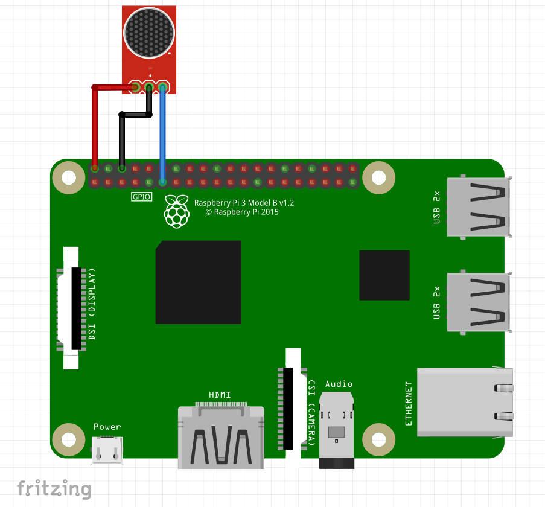

# Introduction
Detect sound with sound sensor 

# Wiring



|sound sensor      |  raspberry pi  |
|------------------|----------------|
| Ground 		   | GND            |
| Vcc / + 		   | 5V             |
| DO 			   | GPIO 21        |


# Code

## 1- Power your raspberry

You can achive it with connecting it to your pc trought the Micro USB Port of the raspberry pi


## 2- Connect to your raspberry pi
Using putty if you're on windows, Ssh if you're on a linux based os
Follow the following instruction if you dont know how to connect to raspberry pi
[Connect to raspberry pi using Putty](https://github.com/ionoid-io-projects/workshop/blob/master/doc/od-iot-raspbian-rpi-zero-windows.md#5-first-boot)

## 3- Download sound Sensor binary file

Assuming you're connected with... copy and past this command
If you're using Raspberry zero
```
curl -O https://raw.githubusercontent.com/ionoid-io-projects/workshop_sound_sensor/master/bin/arm6/sound
```

If you're using Raspberry 3 b
```
curl -O https://raw.githubusercontent.com/ionoid-io-projects/workshop_sound_sensor/master/bin/arm7/sound
```
## make it executable
```
chmod +x sound
```

## 4- execute binary
```
./sound
```

## How to stop the program
To quit or stop the program click on **Ctrl+C**


Congratulation.

Ressource
Follow link below for pin connections 
https://www.piddlerintheroot.com/sound-sensor/